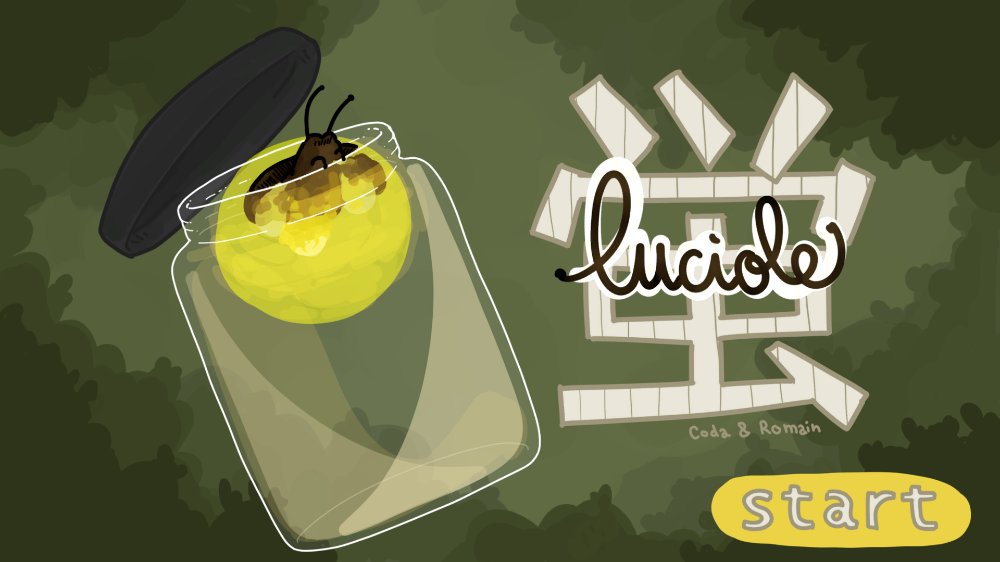
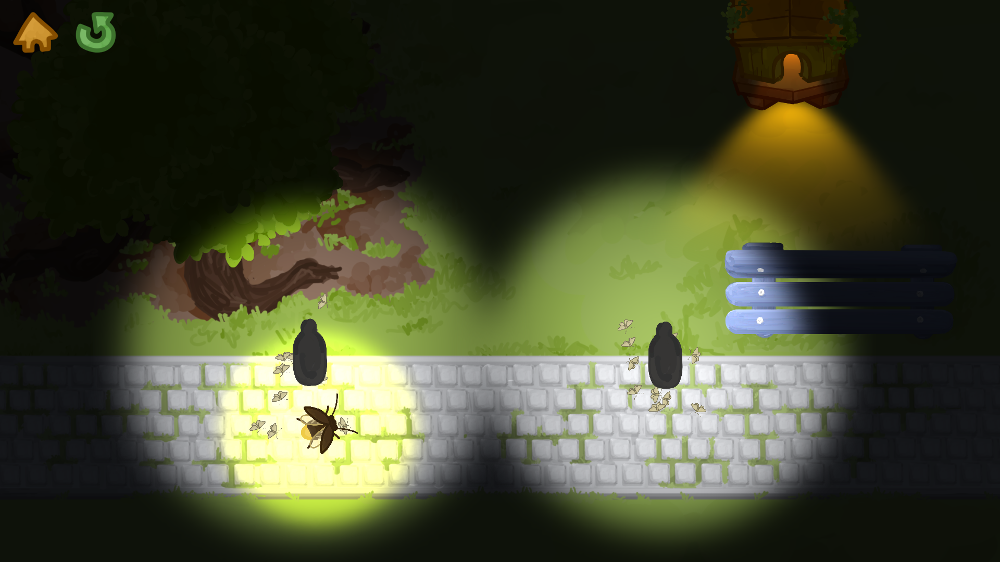
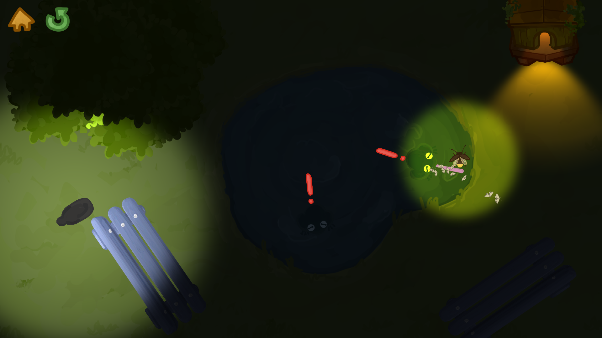
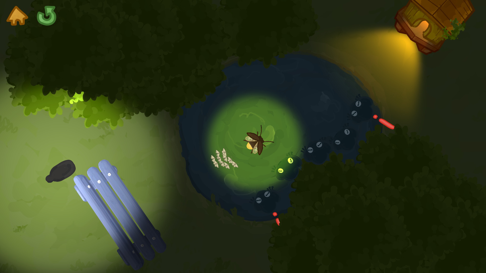

# Luciole

Luciole is a game made in 3 days during the ZenoGameJam. It ran from May 27th 2022 at 6:30 PM to May 30th 2022 at 6:30 PM

# Goal

You are a little luciole that needs to guide moths to their house.

# Screenshots

# Results

_On 74 submissions and over 1 000 ratings_

# More details
- [itch.io page](https://romain-1.itch.io/luciole)
- [submission page](https://itch.io/jam/zeno-jam-the-perfect-jam-for-beginners-5/rate/1553047)
- [zenogamejam](https://itch.io/jam/zeno-jam-the-perfect-jam-for-beginners-5)
